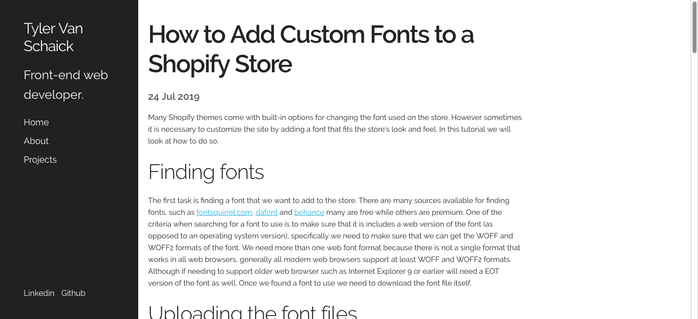

# [tyler-vs.github.io](https://github.com/tyler-vs/tyler-vs.github.io)



A personal portfolio site built using the [Skeleton CSS](http://getskeleton.com/) and [Jekyll](https://jekyllrb.com/) and heavily based off the [Hyde theme](https://github.com/poole/hyde) built by [@mdo](http://markdotto.com/) and was built using [Sublime Text 3](https://www.sublimetext.com/).

## Options

### Reverse layout

Similar to Hyde, the theme's layout can be reverse by adding a class to the `<body>` tag. 

```html

<body class="reverse-layout">
  ...
</body>

```

## Credits

- [Dave Gamache's Skeleton 2.04](https://github.com/dhg/Skeleton/)
- [Jekyll](https://jekyllrb.com/docs/home/)
- [Hyde](https://github.com/poole/hyde)
- [Mark Otto](https://github.com/mdo)
- [Real Favicon Generator](https://realfavicongenerator.net/)